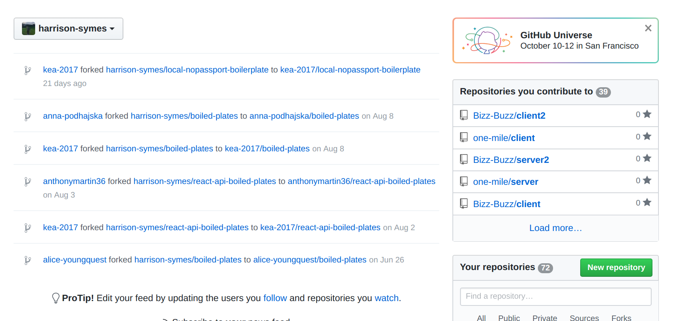
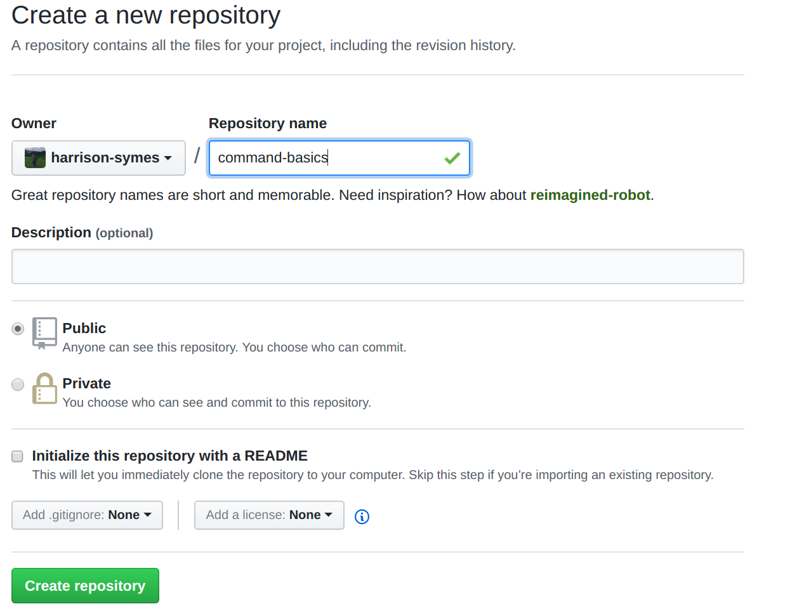
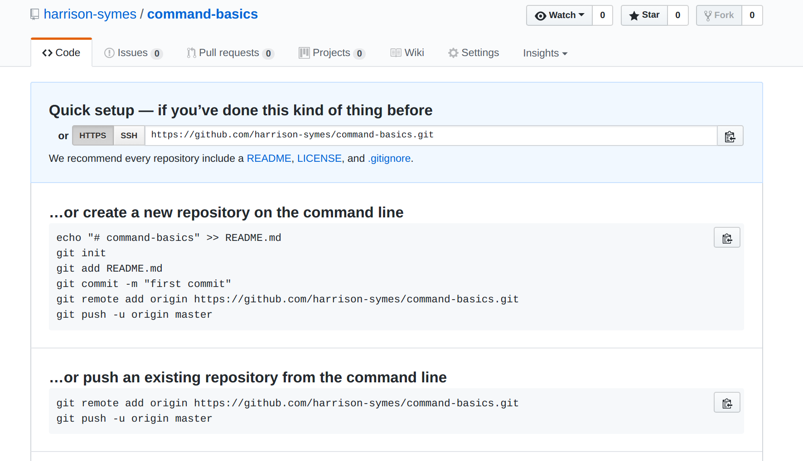
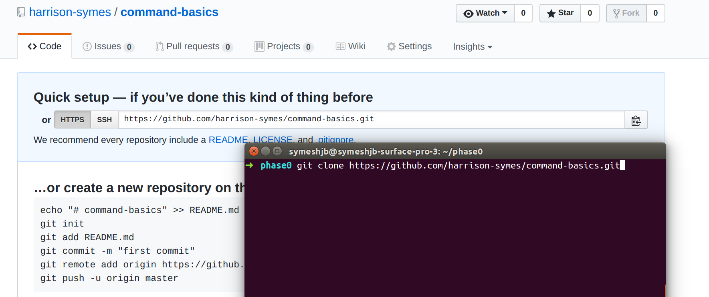
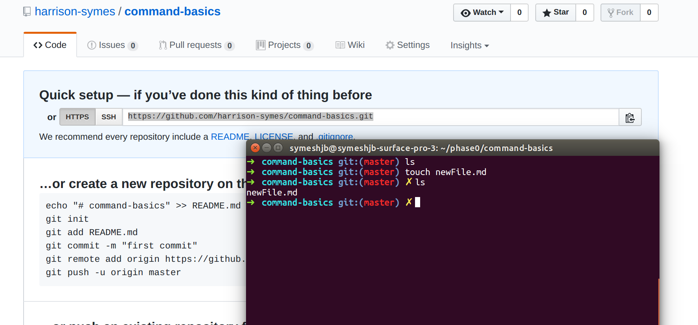

# Git / Command Line Basics

- By Harrison Symes for EDA phase 0 students
- Helpful for Sprint 1, task 1.2

### Make a new repo
  
  * On github, navigate to your main page
  * Make sure you see your username/image on the top left dropdown (refer to image)
  * Click the green button on the bottom right (refer to image) to create a new Repository

  
  * Type the name of your new repo in the text input (sprint-1, for example)
  * Don't worry about the other options for now, hit that green button at the bottom to create your repo

  
  * You should see something like the image above
  * This means your repo has been created, but it has nothing inside it. It still exists though! Copy that url in the 'quick setup' section, and now we are gonna clone your empty repo dropdown

### Cloning a Repository
  
  * Navigate to your workspace folder in your terminal by running `cd ~/workspace`
  * Then run the command `git clone GIT_URL_HERE` to clone down your repo.
  * If you run the `ls` command you should see an empty folder with the same name as the repository that you just created (like 'sprint-1')

### Lets make a file!
  * navigate to your new directory with `cd REPO_NAME_HERE`
  * run the command `touch NEW_FILE_NAME` to create a new file within your current working directory
  * Create a file with the `.md` extension to make a snazzy readme file (similar to this one you are reading)
  
